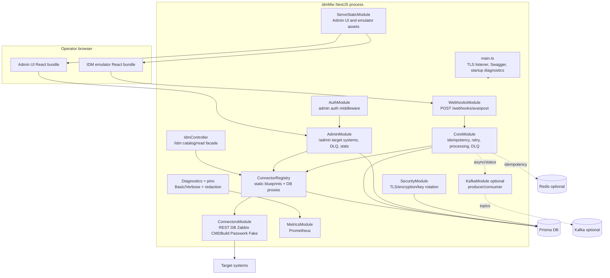
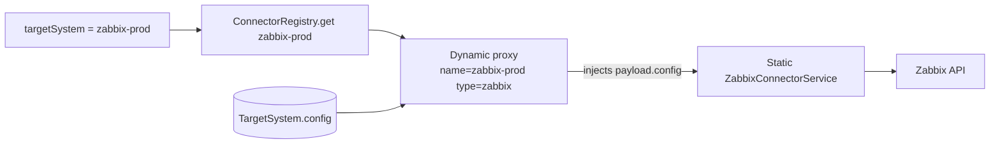

# Container and component view

idmMw поставляется как один NestJS backend process плюс статически раздаваемые
frontend bundles. В production горизонтальное масштабирование выполняется
несколькими одинаковыми backend instances за внешним reverse proxy/load balancer.

## Logical container diagram

## Backend modules

| Module                                | Role                                                                      | Notes                                                                              |
| ------------------------------------- | ------------------------------------------------------------------------- | ---------------------------------------------------------------------------------- |
| `WebhooksModule`                      | Validates Avanpost-compatible webhook payloads and calls `WebhookService` | Uses `AuditInterceptor`; emits diagnostic events                                   |
| `CoreModule`                          | Idempotency, retry, processing, DLQ                                       | Write operations use retry/DLQ; read operations return synchronously               |
| `ConnectorsModule`                    | Provides static connector implementations                                 | REST, DB, Zabbix, CMDBuild, Passwork, fake                                         |
| `ConnectorRegistry`                   | Runtime routing table                                                     | Static connector names plus DB-backed dynamic proxies keyed by `TargetSystem.name` |
| `AdminModule`                         | Admin API for `TargetSystem`, DLQ, stats                                  | CRUD reloads registry without restart                                              |
| `AuthModule`                          | Optional admin auth                                                       | Applies to `/admin/*`, not to `/webhooks/*` or `/idm/*`                            |
| `KafkaModule`                         | Optional async pipeline and status publishing                             | Loaded when not in `LIGHTWEIGHT_MODE`                                              |
| `SecurityModule`                      | Encryption and TLS helpers                                                | AES-256-GCM envelopes, keyring, TLS option factories                               |
| `DiagnosticsModule`                   | Safe diagnostic events                                                    | `Basic` and `Verbose`; all secret-like fields redacted                             |
| `MetricsModule`                       | Prometheus metrics                                                        | HTTP and connector/DLQ metrics                                                     |
| `AdminUiModule` / `ServeStaticModule` | Admin UI and IDM emulator assets                                          | Same-origin browser apps                                                           |

## Connector routing model

Rules:

- Static connector `name` is the connector type, for example `zabbix`.
- DB `TargetSystem.name` is the runtime routing key, for example
  `zabbix-prod`.
- DB `TargetSystem.type` points to the static connector blueprint.
- DB `TargetSystem.config` is injected into `payload.config` by the proxy.
- IDM-supplied mutable business fields stay in `payload.data`.
- IDM read filters/path-like values stay in `payload.params`.
