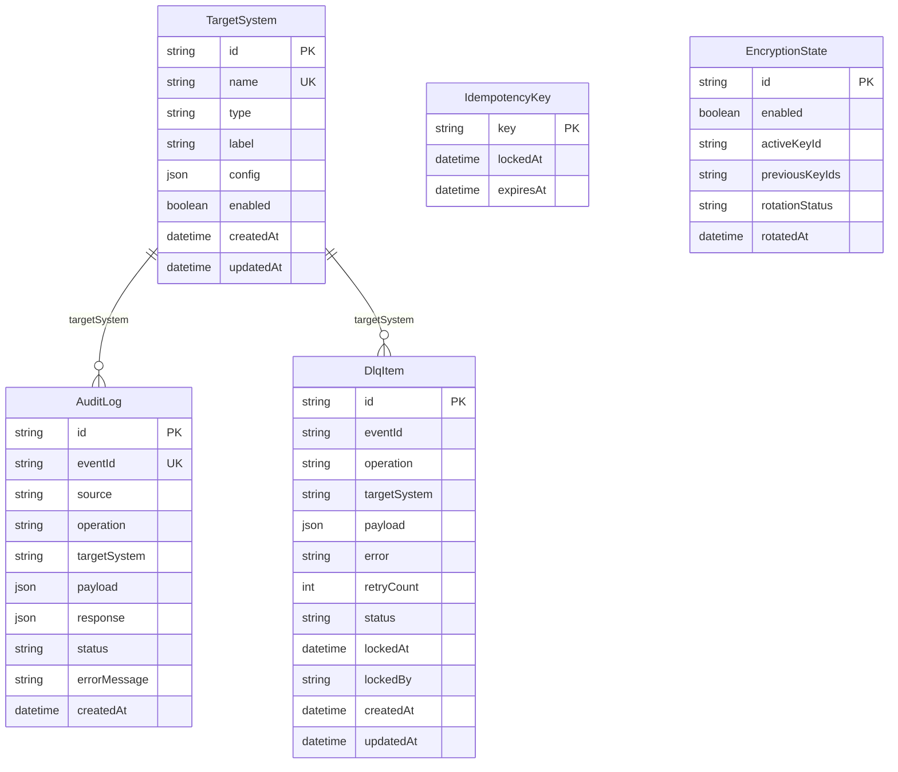

# Data and security view

## Data model

## Data classification

| Field / payload             | Classification                                              | Control                                                 |
| --------------------------- | ----------------------------------------------------------- | ------------------------------------------------------- |
| `TargetSystem.config`       | High: endpoint credentials, tokens, TLS material references | `ENCRYPTION_ENABLED=true`, redaction, admin auth        |
| `AuditLog.payload/response` | Medium/High depending on IDM payload                        | encryption at rest, retention policy, redaction in logs |
| `DlqItem.payload/error`     | Medium/High because failed payload is replayable            | encryption at rest, protected Admin API                 |
| Kafka payloads              | Medium/High when business payload contains identity data    | `ENCRYPTION_KAFKA_ENABLED` inherits encryption default  |
| `IdempotencyKey.key`        | Medium: may expose business event identifiers               | HMAC when `ENCRYPTION_IDEMPOTENCY_HMAC_ENABLED`         |
| Metrics                     | Low: aggregate operational counters                         | no payload/secrets                                      |

## Encryption model

- Encryption envelope: `AES-256-GCM`, marker `idmmw.v1`.
- Active key comes from `ENCRYPTION_ACTIVE_KEY_ID`.
- Keyring comes from `ENCRYPTION_KEYS` plus `ENCRYPTION_KEY_<KEY_ID>` values.
- Base64 key material must decode to 32 bytes.
- Encrypted domains:
  - `TargetSystem.config`
  - audit JSON
  - DLQ JSON
  - Kafka payloads when enabled
  - idempotency keys through HMAC when enabled
- First production enablement is only safe before secrets/events are stored.
- Rotation is a maintenance action, not a normal runtime path.

Detailed procedure: [../SECURITY_TLS_ENCRYPTION.md](../SECURITY_TLS_ENCRYPTION.md).

## TLS model

| Connection                                           | Config namespace          |
| ---------------------------------------------------- | ------------------------- |
| Inbound API/Admin UI                                 | `HTTP_TLS_*`              |
| Redis                                                | `REDIS_TLS_*`             |
| Kafka                                                | `KAFKA_TLS_*`             |
| DB connector target                                  | `DB_CONNECTOR_TLS_*`      |
| Per-target REST/Zabbix/CMDBuild/Passwork/fake remote | `TargetSystem.config.tls` |

Production may terminate TLS at a trusted gateway, but this must be an explicit
platform decision. If idmMw directly exposes HTTP, set `HTTP_TLS_ENABLED=true`.

## Admin and IDM auth boundary

- `/admin/*` is protected by `ADMIN_AUTH_ENABLED=true` in production.
- `ADMIN_AUTH_MODE=local`, `sso` or `both`.
- `/webhooks/avanpost` and `/idm/*` are IDM-facing integration endpoints and
  are not protected by admin auth.
- IDM endpoint protection is expected through network policy, TLS, gateway auth
  or deployment-specific controls.

## Diagnostic logging and redaction

P0 runtime baseline:

- Debug/diagnostic mode is runtime-configurable without code changes.
- Production default is off: `DebugLogging__Enabled=false`.
- Supported levels: `Basic`, `Verbose`.
- `Basic` emits routing/startup diagnostics without sensitive payload details.
- `Verbose` can emit payload shape/details only with redaction and only
  temporarily.
- Structured logs use pino and always go to stdout/stderr.
- `LOG_SINK=file` adds a second JSON sink at `LOG_FILE_PATH`; production may
  instead use collector/sidecar/syslog/ELK/Kafka route for stdout/stderr.

Known redaction domains include authorization/cookie headers, connector tokens,
API keys, master key hashes, TLS private material, wallet passwords and
password-like data fields.

## Audit and retention considerations

`AuditLog` and `DlqItem` intentionally keep operationally useful data. For
production, define retention outside this repository:

- audit retention period;
- DLQ retention and escalation policy;
- log retention and export destination;
- metrics retention;
- key rotation schedule and emergency revocation process.
