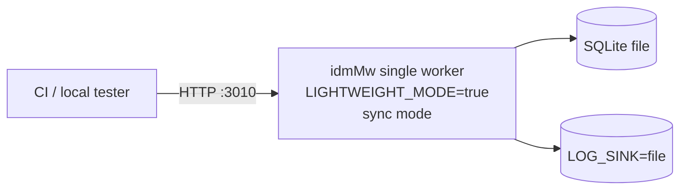
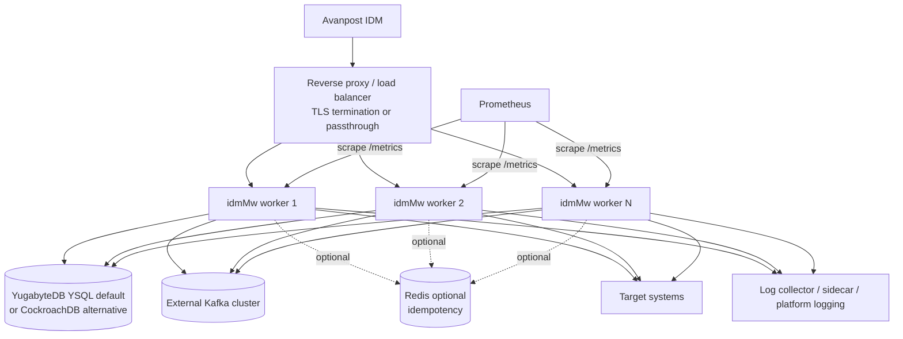

# Deployment view

idmMw has five documented deployment profiles:

- `dev-sqlite` - default administrator-facing DEV profile; prebuilt image,
  SQLite volume, no Kafka/Redis.
- `dev-postgres` - DEV APP + PostgreSQL compose profile with prebuilt app image.
- `sqlite-test` - one worker, SQLite, no Kafka/Redis; CI smoke and disposable
  stands only.
- `prod-ha-yugabyte` - production HA default; external Kafka and YugabyteDB
  YSQL through the normal PostgreSQL Prisma provider.
- `prod-ha-cockroach` - production HA alternative; external Kafka and
  CockroachDB through `prisma/schema.cockroach.prisma`.

Detailed operator commands live in
[../DEPLOYMENT_PROFILES.md](../DEPLOYMENT_PROFILES.md).
Administrator container handoff lives in
[../CONTAINER_DEPLOYMENT_ADMIN_GUIDE.md](../CONTAINER_DEPLOYMENT_ADMIN_GUIDE.md).

## sqlite-test profile



Contract:

- `DATABASE_PROVIDER=sqlite`
- `LIGHTWEIGHT_MODE=true`
- `IDMMW_PROCESSING_MODE=sync`
- `KAFKA_ENABLED=false`
- `REDIS_ENABLED=false`
- `DebugLogging__Enabled=true`
- `DebugLogging__Level=Verbose`
- `LOG_SINK=file`

This profile is intentionally not production-grade because connector secrets
would be stored without production encryption and without HA storage.

## Production HA profile



Production contract:

- `NODE_ENV=production`
- `LIGHTWEIGHT_MODE=false`
- `DATABASE_PROVIDER=postgresql`
- `DATABASE_FLAVOR=yugabytedb` or `cockroachdb`
- `IDMMW_PROCESSING_MODE=async`
- `KAFKA_ENABLED=true`
- `ENCRYPTION_ENABLED=true`
- `ADMIN_AUTH_ENABLED=true`
- `HTTP_TLS_ENABLED=true` or equivalent trusted gateway TLS
- `DebugLogging__Enabled=false`
- `DebugLogging__Level=Basic`
- `LOG_SINK=stdout` plus platform collector/sidecar/syslog/ELK/Kafka route

## Scaling assumptions

| Area                | Assumption                                                                               |
| ------------------- | ---------------------------------------------------------------------------------------- |
| HTTP ingress        | Any worker can receive a webhook; idempotency prevents duplicate processing              |
| Async writes        | Workers share one `KAFKA_CONSUMER_GROUP_ID`                                              |
| DLQ retry           | Lease fields on `DlqItem` prevent concurrent retry of the same item                      |
| TargetSystem config | Stored centrally in DB; CRUD triggers `ConnectorRegistry.reload()` on the serving worker |
| Secrets             | Encrypted at rest with `ENCRYPTION_*`; external secret provider can supply key material  |
| Logs                | stdout/stderr is always active; additional sink is platform-specific                     |

## CI gates

GitLab CI checks:

- backend validate/build/lint/unit/e2e
- frontend lint/build
- `profile:sqlite-test:smoke`
- `profile:prod-ha:yugabyte:validate`
- `profile:prod-ha:cockroach:validate`
- `runtime:smoke`
- manual `profile:prod-ha:live` for real Kafka/Redis/container runner

Local equivalent:

```bash
npm run profile:validate -- sqlite-test
npm run profile:smoke:sqlite
npm run profile:validate -- prod-ha-yugabyte
npm run profile:validate:prod-ha -- yugabyte
npm run profile:validate -- prod-ha-cockroach
npm run profile:validate:prod-ha -- cockroach
npm run test:runtime-smoke
```
