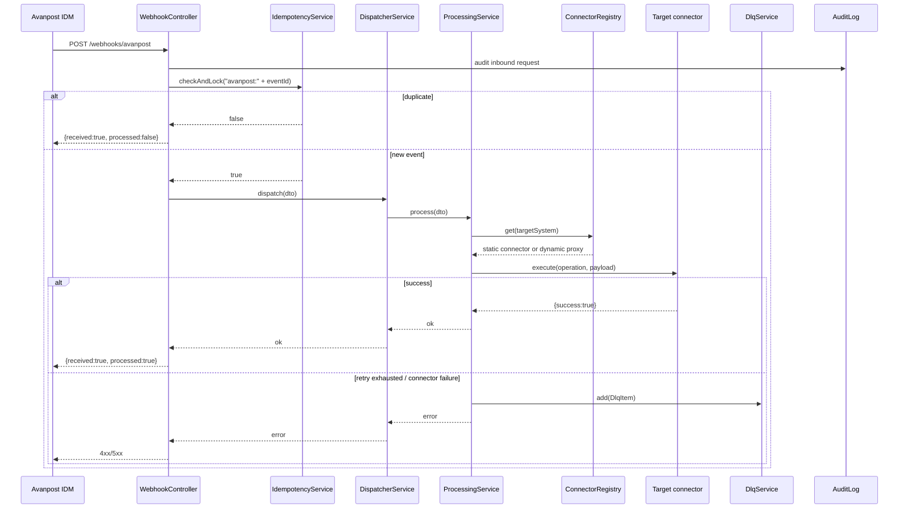
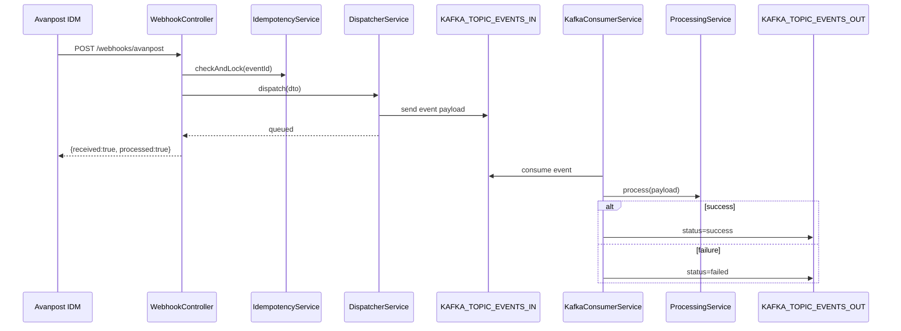
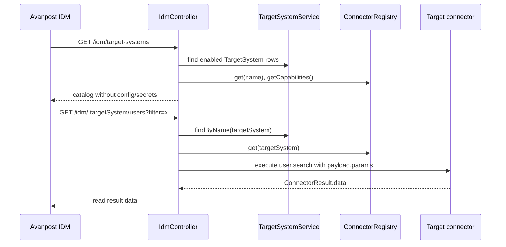
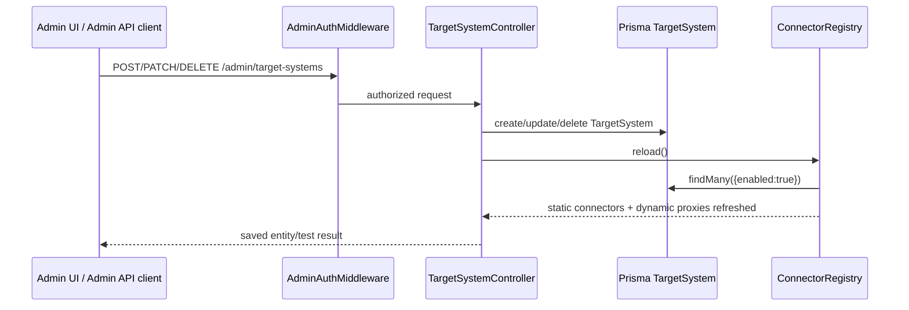
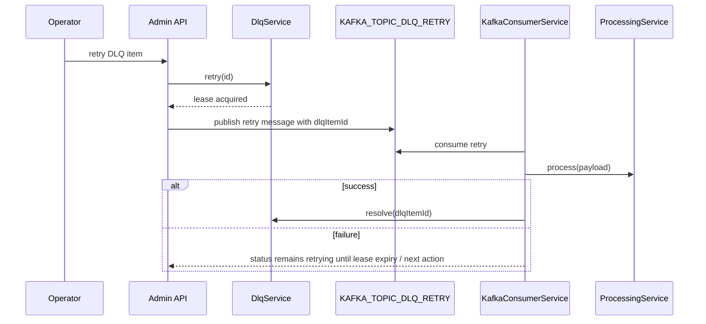
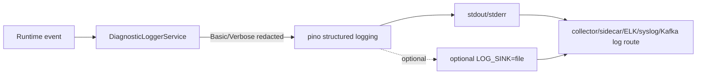

# Runtime flows

## Sync write webhook

## Async write webhook

`IDMMW_PROCESSING_MODE=async` requires `KAFKA_ENABLED=true`.

## Read/catalog facade for IDM

Read operations are synchronous and do not use Kafka, retry or DLQ. They are
used by IDM for catalog, schema, user/group search and connection tests.

## Admin TargetSystem CRUD and registry reload

## DLQ retry

## Diagnostic logging flow

