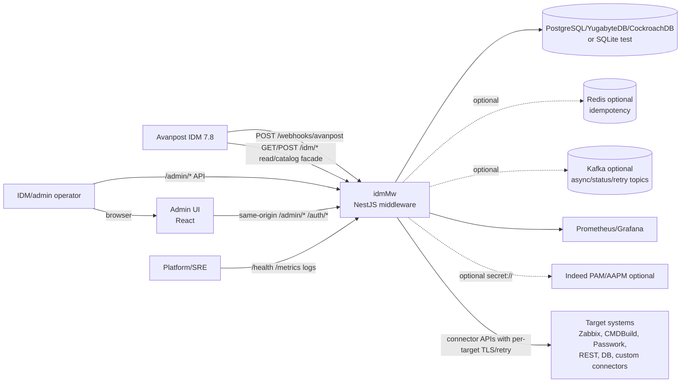

# System context

idmMw - middleware endpoint для Avanpost IDM 7.8. IDM видит одну интеграцию,
а idmMw маршрутизирует события в несколько целевых систем по `targetSystem`.

## Primary responsibilities

- Принимать Avanpost-compatible события на `POST /webhooks/avanpost`.
- Поддерживать каталог и read facade для IDM через `/idm/*`.
- Хранить и применять `TargetSystem` configuration без перезапуска runtime.
- Выполнять write/read операции через connectors: REST, DB, Zabbix, CMDBuild,
  Passwork, fake reference connector.
- Обеспечивать idempotency, retry, DLQ, audit, metrics, diagnostic logging,
  TLS и encryption.

## Context diagram

## External actors

| Actor              | Responsibility                                                 | Main endpoints                      |
| ------------------ | -------------------------------------------------------------- | ----------------------------------- |
| Avanpost IDM       | Отправляет write events и вызывает read/catalog facade         | `POST /webhooks/avanpost`, `/idm/*` |
| IDM/admin operator | Создает `TargetSystem`, проверяет связь, смотрит DLQ           | `/admin/*`, Admin UI                |
| Platform/SRE       | Настраивает deployment profile, TLS, secrets, logging, metrics | `/health`, `/metrics`, logs         |
| Target systems     | Получают lifecycle operations от idmMw                         | Connector-specific APIs             |

## Trust boundaries

| Boundary                   | Contract                                                                  |
| -------------------------- | ------------------------------------------------------------------------- |
| IDM -> idmMw inbound       | TLS через `HTTP_TLS_*` или trusted gateway; webhook не требует admin auth |
| Admin browser/API -> idmMw | `/admin/*` защищается `ADMIN_AUTH_ENABLED=true` в production              |
| idmMw -> target systems    | Per-target `config.tls`, `retryPolicy`, endpoint credentials              |
| idmMw -> Kafka/Redis/DB    | TLS через `KAFKA_TLS_*`, `REDIS_TLS_*`, DB connection settings            |
| idmMw -> logs/metrics      | Structured logs with redaction; metrics без секретов                      |
